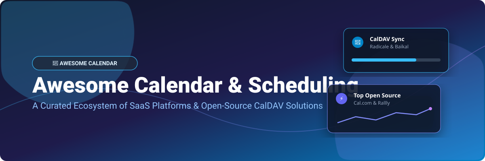

# 📅 Awesome Calendar & Scheduling Ecosystem

> **Curated List of Calendar Software, Scheduling Platforms, CalDAV Sync Tools, and Self-Hosted Open-Source GitHub Projects**  
> *Focused on Appointment Scheduling, CalDAV/CardDAV Syncing, Team Availability, and Personal Information Management (PIM).*

---

## 📊 Market Overview & Industry Insights

> 💡 **Estimated Market Size & Industry Dynamics:**  
> The global appointment scheduling and digital calendar software market is valued at approximately **$1.2 Billion to $1.8 Billion** and is projected to expand at a CAGR of **12.5%** over the coming decade.  
> The sector is **moderately fragmented** — while tech giants like **Microsoft (Outlook)** and **Google (Workspace)** dominate general productivity and enterprise email-bundled calendaring, a vibrant landscape of specialized SaaS tools (e.g., *Cal.com, Notion Calendar, Fantastical*) and privacy-focused open-source CalDAV engines flourish by serving specialized power-user, team scheduling, and self-hosted privacy workflows.

---

## 📋 Table of Contents

- [🏢 SaaS & Hosted Platforms](#-saas--hosted-platforms)
- [🔓 Open-Source GitHub Projects](#-open-source-github-projects)
- [🤝 How to Contribute](#-how-to-contribute)
- [💖 Support & Sponsorship](#-support--sponsorship)
- [📈 Star History](#-star-history)
- [⚠️ Disclaimer](#%EF%B8%8F-disclaimer)

---

## 🏢 SaaS & Hosted Platforms

The table below outlines the top hosted and SaaS calendar solutions, sorted by **company market size (revenue / valuation)** in descending order:

| 🚀 Platform | 🏢 Enterprise Size (Valuation / Annual Revenue) | 💵 Starting Tier Pricing | 🎁 Free Tier / Trial Limits | 📌 Key Features & Highlights |
| :--- | :--- | :--- | :--- | :--- |
| **[Microsoft Outlook Calendar](https://www.microsoft.com/microsoft-365/outlook/)** | **$3.1 Trillion Valuation** (~$281.7B Rev) | **$6.00/user/month** (Microsoft 365 Business Basic) | **Free web version** (Outlook.com with 15 GB storage limit) | Enterprise standard bundled with Office 365, Copilot AI, and Teams scheduling integration. |
| **[Google Calendar](https://calendar.google.com/)** | **$2.0 Trillion Valuation** (~$24.8B Cloud Q2 Rev) | **$6.00/user/month** (Google Workspace Business Starter) | **100% Free for personal use** (Requires free Google account) | Ubiquitous personal & team calendar with Gmail integration and appointment scheduling. |
| **[Notion Calendar](https://www.notion.so/product/calendar)** | **$11.0 Billion Valuation** (~$865M Rev) | **$10.00/user/month** (Notion Plus Plan) | **Free tier available** (Includes 1 individual account & Notion workspace sync) | Formerly Cron; modern developer-favorite calendar with tight Notion workspace integration. |
| **[Zoho Calendar](https://www.zoho.com/calendar/)** | **$1.4 Billion Revenue** (Bootstrapped) | **$1.00/user/month** (Zoho Mail Lite Plan) | **Free tier available** (Forever free for up to 5 users with 5 GB/user) | Full-featured calendar app integrated into the cost-effective Zoho enterprise suite. |
| **[TimeTree](https://timetreeapp.com/)** | **$39.9 Million Raised** (60M+ Users) | **$4.49/month** (TimeTree Premium) | **Free tier available** (Ad-supported free shared calendars with unlimited members) | Dedicated shared calendar platform designed for families, couples, and social groups. |
| **[Fantastical](https://flexibits.com/fantastical)** | **~$15.0 Million Revenue** (Flexibits Private) | **$6.99/month** ($56.99 billed annually) | **14-day Free Trial** (Includes limited core free features post-trial) | Apple-first premium calendar with natural language parsing and multi-calendar overlays. |
| **[Vimcal](https://www.vimcal.com/)** | **$7.0 Million Raised** (~$2.3M Rev) | **$15.00/month** ($12.50/mo billed annually) | **7-day Free Trial** (No permanent free tier) | Keyboard-first productivity calendar built for executives, founders, and power users. |
| **[Morgen](https://www.morgen.so/)** | **$1.3 Million Revenue** (CHF 1M Seed Raised) | **$15.00/month** (Pro Plan billed annually) | **14-day Free Trial** (No permanent free plan available) | Unified calendar, time-blocking, and task manager with multi-account integration. |
| **[Calendar.com](https://www.calendar.com/)** | **~$1.0 Million Revenue** (Venture Backed) | **$24.00/user/month** (Standard Paid Tier) | **Free tier available** (Basic plan limited to 1 connected calendar account) | Smart online calendar offering appointment scheduling links and team availability analytics. |

---

## 🔓 Open-Source GitHub Projects

Below is a list of top open-source calendar tools, CalDAV servers, mobile apps, and group meeting schedulers, sorted by **GitHub Star Count** in descending order:

| ⭐ Repository & Stars | 🛠️ Category & Description | ⚖️ License |
| :--- | :--- | :--- |
| **[Cal.com](https://github.com/calcom/cal.com)**    | ⚡ **Open-source Calendly Alternative** — Enterprise-grade scheduling infrastructure with workflow automation, CalDAV integration, and multi-calendar booking pages. | AGPL-3.0 |
| **[Thunderbird Android](https://github.com/thunderbird/thunderbird-android)**    | 📱 **Mobile Email & Calendar Client** — Open-source mobile client for Android (formerly K-9 Mail) with full calendar and scheduling capabilities. | MPL-2.0 |
| **[Tutanota / Tuta](https://github.com/tutao/tutanota)**    | 🔐 **Encrypted Mail & Calendar** — Privacy-first, end-to-end encrypted calendar and email application across desktop and mobile. | GPL-3.0 |
| **[Proton Web Clients](https://github.com/protonmail/WebClients)**    | 🛡️ **Encrypted Calendar & Web Suite** — Official web applications for Proton Calendar and Proton Mail, featuring zero-knowledge encryption. | GPL-3.0 |
| **[Rallly](https://github.com/lukevella/rallly)**    | 📊 **Group Meeting Polls** — Self-hosted Doodle alternative for finding the best time to meet with poll links and automated ICS invites. | MIT |
| **[Radicale](https://github.com/Kozea/Radicale)**    | 🖥️ **Lightweight CalDAV & CardDAV Server** — Python-based minimal CalDAV server storing `.ics` files directly on disk with native Git backup support. | GPL-3.0 |
| **[Baïkal](https://github.com/sabre-io/Baikal)**    | 🌐 **PHP CalDAV & CardDAV Server** — Lightweight web server interface for managing personal calendars and address books built on SabreDAV. | GPL-3.0 |
| **[khal](https://github.com/pimutils/khal)**    | 🖥️ **CLI & TUI Calendar Client** — Standards-based terminal calendar application built for Linux/Unix command-line enthusiasts. | MIT |
| **[DAVx⁵](https://github.com/bitfireAT/davx5-ose)**    | 🔄 **Android CalDAV & CardDAV Sync Engine** — Essential open-source sync adapter bridging CalDAV servers with the Android system calendar store. | GPL-3.0 |
| **[Etar Calendar](https://github.com/Etar-Group/Etar-Calendar)**    | 📲 **Open-Source Android Calendar App** — Clean, material-design calendar application for Android operating systems. | GPL-3.0 |
| **[Fossify Calendar](https://github.com/FossifyOrg/Calendar)**    | 🔒 **Privacy Android Calendar** — Ad-free, offline-first Android calendar forked from Simple Mobile Tools with zero tracking. | GPL-3.0 |
| **[SOGo](https://github.com/Alinto/sogo)**    | 🏛️ **Enterprise Groupware Server** — Scalable groupware offering calendaring, WebDAV/CalDAV, and Microsoft ActiveSync support. | GPL-2.0 |
| **[vdirsyncer](https://github.com/pimutils/vdirsyncer)**    | ⚙️ **CalDAV Synchronization CLI Tool** — Command-line utility to synchronize CalDAV calendars and CardDAV address books with local storage. | MIT |
| **[SabreDAV](https://github.com/sabre-io/dav)**    | 🧰 **PHP CalDAV & CardDAV Framework** — The underlying PHP webdav/caldav framework powering Baïkal, Nextcloud Calendar, and ownCloud. | MIT |
| **[Nextcloud Calendar](https://github.com/nextcloud/calendar)**    | ☁️ **Self-Hosted Cloud Calendar** — Official calendar interface for Nextcloud instances with web scheduling, resource booking, and sharing. | AGPL-3.0 |
| **[EventQL](https://github.com/eventql/eventql)**    | 🗄️ **Distributed Event Storage Engine** — Database framework tuned for high-throughput time-series event data and calendar analytics. | AGPL-3.0 |
| **[AgenDAV](https://github.com/agendav/agendav)**    | 🌐 **Webmail-Style CalDAV Web Client** — Browser client presenting a Google Calendar-like AJAX user interface for CalDAV backends. | GPL-3.0 |
| **[Xandikos](https://github.com/jelmer/xandikos)**    | 🐍 **Git-Backed CalDAV Server** — Python CalDAV server storing calendar events directly inside a Git repository for complete change tracking. | GPL-3.0 |
| **[chroncal](https://github.com/douglasdemoura/chroncal)**    | ⌨️ **Terminal TUI Calendar & iCal** — Interactive terminal UI written for managing CalDAV events, tasks, RRULE recurrence, and iCal exports. | MIT |
| **[GNOME Calendar](https://github.com/GNOME/gnome-calendar)**    | 🐧 **Linux Desktop Calendar** — Official GTK calendar for GNOME desktop environments supporting online account sync and local files. | GPL-3.0 |
| **[KDE Merkuro Calendar](https://github.com/KDE/merkuro)**    | 🐧 **KDE Kirigami Calendar** — Modern KDE desktop calendar and task manager supporting Nextcloud, Google Calendar, and CalDAV. | GPL-3.0 |
| **[KDE KOrganizer](https://github.com/KDE/korganizer)**    | 🗓️ **KDE Kontact Calendar Engine** — Classic KDE calendar manager for event scheduling, alarm notifications, and web exports. | GPL-2.0 |

---

## 🛠️ Architecture & Stack Recommendations

- **Privacy-First Self-Hosting:** Combine **Radicale** or **Baïkal** as a lightweight backend with **DAVx⁵** on Android and **Fossify Calendar** / **GNOME Calendar** on desktop.
- **Enterprise Booking Pages:** Deploy **Cal.com** or **calrs** for automated scheduling pages, timezone conversions, and booking payments.
- **Group Availability Polls:** Self-host **Rallly** as an ad-free Doodle alternative for team event planning.

---

## 🤝 How to Contribute

1. **Fork** this repository.
2. Add your tool under either **SaaS & Hosted Platforms** or **Open-Source GitHub Projects**.
3. Ensure open-source projects include star badges linking to their `stargazers` page (`https://github.com/user/repo/stargazers`).
4. Keep entries concise, factual, and strictly accurate.
5. Open a **Pull Request** with your changes!

---

## 💖 Support & Sponsorship

Thank you for exploring **Awesome-Calendar**! If you find this curated list helpful for your personal setup, business, or development workflow, please consider supporting the project:

- ⭐ **Star this repository** to help others discover it!
- 🍴 **Fork and share** it with your developer and self-hosting networks.
- ☕ **Sponsor the author:** Buy me a coffee or support ongoing maintenance via the [GitHub Sponsor Dashboard](https://github.com/sponsors/ishandutta2007).

---

## 📈 Star History

---

## ⚠️ Disclaimer

- This is a community-maintained curated list for educational and informational purposes.
- Calendar & scheduling applications handle sensitive PIM data. Always ensure proper HTTPS/TLS encryption and backups when hosting self-hosted servers.

---

Made with ❤️ for privacy-conscious users, self-hosters, and productivity power users.

